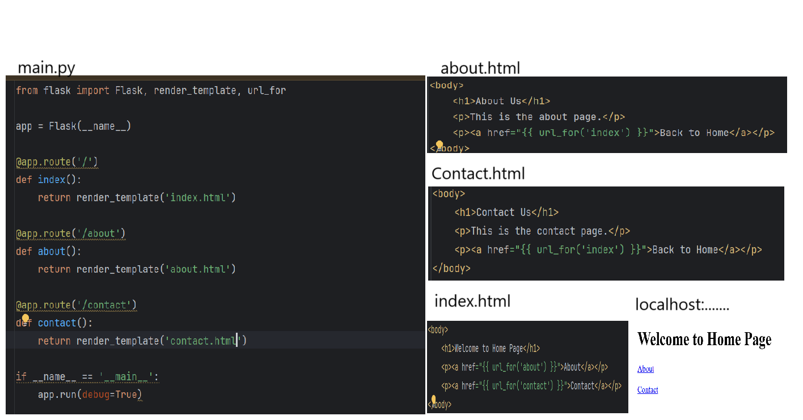
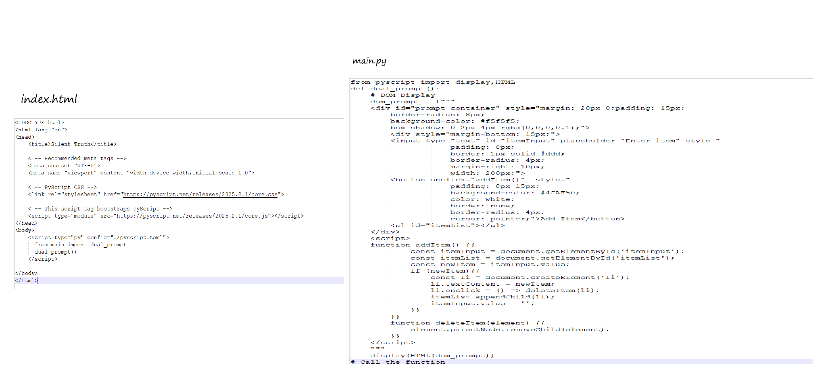
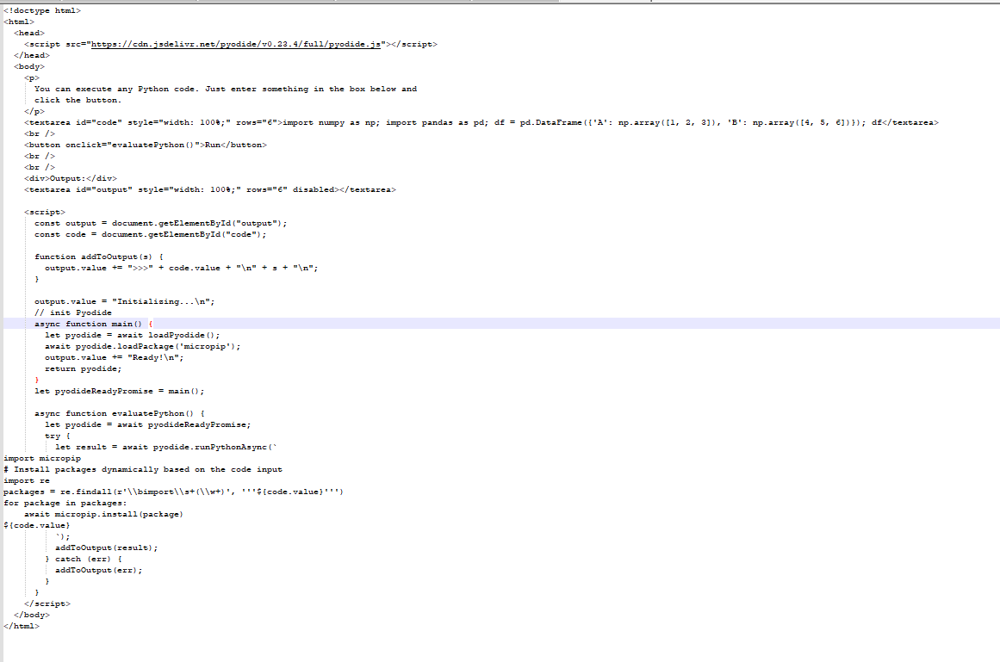

    

        <h2 class="presenter-title"><em style="color: #FDA703; font-style: normal; font-weight: bold;"></h2>
          <h3 class="presenter-title" style="padding: 0; font-size: 1.4em !important;">WEB DEVELOPMENT IN PYSCRIPT  </h3>
          <h4 class="presenter-title" style="padding: 0; font-size: 1√em !important;">Nasrin Pathan</h4>
           
          <h6 class="presenter-title" style="padding: 0; margin-top: 0; margin-bottom: 0;">
              <i class="fa fa-envelope"></i>
              <code class="contacts">nasrinbegump@gmail.com</code>
              <code class="contacts">nasrinpathan80@gmail.com</code>
          </h6>
           
          <h6 class="presenter-title" style="padding: 0; margin-top: 0; margin-bottom: 0;">
              <i class="fa fa-twitter"></i>
              <code class="contacts"></code>
      </h6>
    

    

        
    

---

    

        <h2>About Nasrin</h2>
    

    

        <ul>
            <li>Founder of Pyscript on PyCharm.</li>
            <li>Mediator between Jupyter community and Pyscript community.</li>
        </ul>
    

---

<h2 style="text-transform: none;">
    Hello! 😍
</h2> 

---
## Is your website really safe?
<a href="https://nasrin1748.github.io/uk_school/" target="_blank">link</a>
---
## Traditional Web development 
    
---
## Traditional Web development in Pyscript
---
<h7>How it Started?</h7>

---
<h7>Using Pyscript</h7>
<a href="https://nasrin1748.github.io/pyscript-test/" target="_blank">(link)</a>

---
<h7>Using Django</h7>

---

OAuth Application deployed all the Desktop applications and moved to Github beta which blocks all desktop applications.

---
## What is Web development in New Advanced PyScript?
<ul class="fragment">
     <li class="fragment">
      Single page web development.
    </li>
    <li class="fragment">
      More secure.Less chances of scraping. 
    </li>   
---
First Website    
      
<a href="https://nasrin1748.github.io/pythonProject1/" target="_blank">link</a>
---
Getting python function to Javascript.

---
Second Website

<a href="https://nasrin1748.github.io/website/" target="_blank">link</a>
---
latest version was removed.
<iframe width="560" height="300" src="https://www.youtube.com/embed/WfgCKdiuEms?si=mYYBe5-LoqkH-iH"  frameborder="0" allow="accelerometer; autoplay; clipboard-write; encrypted-media; gyroscope; picture-in-picture; web-share" referrerpolicy="strict-origin-when-cross-origin" allowfullscreen credentialless></iframe><iframe width="560" height="300" src="https://www.youtube.com/embed/qTueh5Wym-8?si=mYYBe5-LoqkH-iH"  frameborder="0" allow="accelerometer; autoplay; clipboard-write; encrypted-media; gyroscope; picture-in-picture; web-share" referrerpolicy="strict-origin-when-cross-origin" allowfullscreen credentialless></iframe>
---
Third Website to Work

<iframe width="560" height="315" src="https://nasrin1748.github.io/TO_D0/"  frameborder="0" allow="accelerometer; autoplay; clipboard-write; encrypted-media; gyroscope; picture-in-picture; web-share" referrerpolicy="strict-origin-when-cross-origin" allowfullscreen credentialless></iframe>
<a href="https://nasrin1748.github.io/TO_D0/" target="_blank">link</a>
---
<iframe width="560" height="315" src="https://nasrin1748.github.io/sql_lite/"  frameborder="0" allow="accelerometer; autoplay; clipboard-write; encrypted-media; gyroscope; picture-in-picture; web-share" referrerpolicy="strict-origin-when-cross-origin" allowfullscreen credentialless></iframe>
---
Things to explore
<ul class="fragment">
     <li class="fragment">
      Java script supports single link web development and its not dependent on internet.
<a href="https://nasrin1748.github.io/pythonProject98/" target="_blank">link</a>
    </li>
    <li class="fragment">
      flask supports single link web development.But Github supports index.html deployments and streamlite has its own way of coding.flask converted to streamlit worked.
    </li> 
   <li class="fragment">
      Should research on getting packages(main.js) to python via micropip and pyodide.
    </li> 
 <li class="fragment">
      Canvas web development on hold it's best for gaming as of now.
    </li> 
</ul>
---
Streamlit verses Pyscript

---
<iframe width="1000" height="600" src="https://nasrin1748.github.io/jupyter_tabextension/" title="YouTube video player" frameborder="0" allow="accelerometer; autoplay; clipboard-write; encrypted-media; gyroscope; picture-in-picture; web-share" referrerpolicy="strict-origin-when-cross-origin" allowfullscreen credentialless></iframe>
<a href="https://3ew6r2fsodalbm2dy2lc82.streamlit.app/" target="_blank">text&nbsp;</a>
<a href="https://appelog-gg7ghfixbzfcqtxkfa4wgp.streamlit.app/" target="_blank">login&nbsp;</a>
---
<h2>PyScript</h2>
<ul class="fragment">
     <li class="fragment">
      Yes pyscript replaced django.  
    </li>
      <li class="fragment">
      Pyscript replaced latest version to some extinct.
    </li>
</ul>    
---
<h3>Interactive Python any where on web.</h3>
<ul>
<li>Is it possible to have multiple interactive Applications per page?Yes its possible for DOM but all of your pages must have same number of interactive Applications.</li>
</ul>
    
---
<h2>Making use of Python packages on web.</h2>
<ul>
<li>Package installation using javascript supports all packages.</li>
<a href="https://nasrin1748.github.io/package_installation/" target="_blank">link</a>
<li>Package installation can be automated.</li>
<a href="https://nasrin1748.github.io/PAckage_installationa/" target="_blank">link</a>
</ul>
---

---
Package installation can be automated.

---
<h2>Bye...Bye... Desktop Applications.</h2>

<ul class="fragment">
    <li class="fragment">
      What's Going to happen when you deploy Desktop Application to Github?  
    </li>
         
    <li class="fragment">
      What's Going to happen when you manually write Desktop Application on Github? 
    </li>
     
---
<h2> Why PyScript?</h2>

<ul class="fragment">
    <li class="fragment">
      Easy Deployment.
    </li> 
     <li class="fragment">
      Single link no chance of scraping.
    </li>
    <li class="fragment">
      Security.
    </li>
     <li class="fragment">
      Support mobile and web.
    </li>
     <li class="fragment">
      Improved execution time.
    </li>
     <li class="fragment">
      Share Application and connect.
    </li>
     <li class="fragment">
      Free Assistance.
    </li>
      <li class="fragment">
      sqlite for database.
    </li>
 <li class="fragment">
      Friendly and Welcoming team.
    </li>
</ul>
---
<h2>Drawbacks</h2>

<ul class="fragment">
    <li class="fragment">
      Dependent on internet.
      <a href="https://nasrin1748.github.io/checkimg1/" target="_blank">link</a>
    </li> 
     <li class="fragment">
      Github(Restrict the uploads of system files.) is more secure than pyscript.com(allow kinds of upload but restrict its usage.)
    </li>
    <li class="fragment">
      No Memory usage restrictions for Uploads with pycharm.
    </li>
   <li class="fragment">
      Doesn't support all packages.
</li>
 <li class="fragment">
      There is no Save.
</li>
</ul>
---
<h2>Next thing coming?</h2>
<h4><a href="https://nasrin1748.github.io/game_trail/" target="_blank">Connect and play together.</a></h4>
Pyscript2
---
<h2>How to Get started? </h2>

<h4><a href="https://pyscript.com" target="_blank">pyscript.com</a></h4>

---

<a href="https://pyscript.github.io/docs/2024.3.2/user-guide/terminal/" target="_blank">Docs</a>

---

<a href="https://nasrin1748.github.io/pythonProject1/" target="_blank">Webdevelopment in Pyscript Example</a>
<a href="https://pyscript.com/@_12/user-inputs-copy-copy-copy-copy-copy/latest?files=main.py" target="_blank">Webdevelopment in Pyscript Example2</a>

---

<a href="https://pyscript.com/@_12/collections/fe0f0a2b-ecc3-42c0-b744-c6313e72c9ac" target="_blank">Fun Games</a>

---
<a href="https://pyscript.com/@_12/collections/3ed2ebb3-3c3c-4bf3-92c3-343c10c898a0" target="_blank">Animations</a>

---
<a href="https://www.youtube.com/@Project-nf3wo" target="_blank">YouTube</a>
<a href="https://x.com/PathanNasr61369" target="_blank">Twitter</a>
---

# Thank you!
